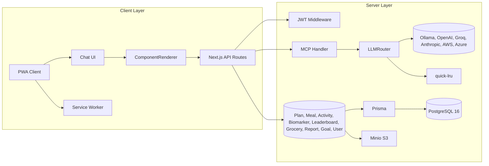

# AI Health Companion – Design Document v1.0

## 1. Purpose & Scope

This document describes the detailed technical design of **AI Health Companion**, a Next.js 14 PWA monorepo offering a chat‑first health management platform. It covers system architecture, data flow, component interfaces, service abstractions, offline behavior, CI/CD, testing, monitoring, security, and developer workflows. Each section is self‑contained so teams can implement features in isolation.

---

## 2. System Architecture

### 2.1 High‑Level Overview



### 2.2 Subsystems

1. **Client (PWA)**

   * Next.js App Router pages + layouts
   * Chat interface with WebSocket/SSE transport
   * Component JSON renderer for interactive cards
   * Service Worker (next‑pwa) for offline caching

2. **API Layer**

   * Next.js API Routes (`/api/*`) for REST endpoints
   * Authentication middleware (JWT)
   * MCP Handler endpoint (`/api/mcp/[transport]`)

3. **MCP & LLM Router**

   * `mcp-handler` manages tool invocations via Zod‑validated schemas
   * `LLMRouter` selects AI provider by normalized latency/cost scoring
   * In‑memory LRU cache (`quick-lru`) for repeated tool results

4. **Service Layer**

   * Business logic by domain: PlanService, MealService, ActivityService, BiomarkerService, LeaderboardService, GroceryService, ReportService, GoalService, UserService
   * Each service uses Prisma for data access and awards leaderboard points

5. **Data Layer**

   * PostgreSQL 16 (Docker container) as primary data store
   * Minio (S3‑compatible) for photos & PDF storage
   * Prisma ORM with migrations & type‑safe client

---

## 3. Directory Structure

```
/app
├─ /api
│   ├─ auth       # register, login, refresh
│   ├─ mcp        # MCP transport routes
│   ├─ chat       # WebSocket handshake (optional)
│   ├─ meals      # plan, log
│   ├─ activities # plan, log
│   ├─ biomarkers # log, trends
│   ├─ leaderboard# top, me, around-me
│   ├─ grocery    # generate list
│   ├─ reports    # PDF/Docx endpoints
│   ├─ goals      # create, progress
│   └─ settings   # admin settings
├─ /components    # shared React components & ComponentRenderer
├─ /context       # Zustand stores & Auth context
├─ /hooks         # custom React hooks
├─ /styles        # MUI theme, global CSS
├─ /chat          # chat page (App Router)
├─ /dashboard     # dashboard page
├─ /leaderboard   # leaderboard page
└─ layout.tsx     # root layout & providers
/lib               # service layer implementations
  ├─ lru.ts        # quick-lru wrapper
  ├─ llmRouter.ts  # provider selection logic
  ├─ planService.ts
  ├─ mealService.ts
  ├─ activityService.ts
  ├─ biomarkerService.ts
  ├─ leaderboardService.ts
  ├─ groceryService.ts
  ├─ reportService.ts
  ├─ goalService.ts
  └─ userService.ts
/prisma            # schema.prisma, migrations
/public            # static assets, manifest.json, icons
/scripts           # dev scripts, db seeders, test runners
/tests             # integration & unit test suites
next.config.js     # Next.js + next-pwa config
tsconfig.json      # TypeScript config
package.json
docker-compose.yml # Postgres, Minio
Dockerfile         # Next.js server image
```

---

## 4. Authentication & Authorization

### 4.1 JWT Flow

* **Register**: `POST /api/auth/register` → hash password (bcrypt12), create user & profile.
* **Login**: `POST /api/auth/login` → issue accessToken (15 min), refreshToken (7 d).
* **Refresh**: `POST /api/auth/refresh` → exchange refreshToken for new accessToken.
* **Storage**: tokens in `localStorage`; axios interceptor attaches `Authorization` header.

### 4.2 Middleware

* Located in `/lib/middleware/auth.ts`
* Validates JWT, injects `req.user = { id, username, scopes }`.
* Used by all `/api/*` routes except `/auth/*`.

### 4.3 MCP Auth

* `withMcpAuth` wrapper on MCP handler enforces same JWT logic and provides `extra.authInfo`.

---

## 5. Chat & Component JSON

### 5.1 Chat Flow

1. User types in `/app/chat/page.tsx` → sends via WebSocket or SSE to `/api/mcp/transport`.
2. `mcp-handler` invokes registered tools or forwards to LLMRouter.
3. LLMRouter returns `LLMResponse` with `content` and optional `toolCalls`.
4. Chat client streams response chunks; component JSON blocks extracted.

### 5.2 Component JSON Format

```jsonc
{
  "type": "RecipeCard",
  "props": {
    "title": "Grilled Salmon",
    "kcal": 850,
    "protein": 60,
    "netCarbs": 10,
    "fat": 50,
    "ingredients": [ ... ],
    "instructions": "Preheat…"
  },
  "id": "uuid"
}
```

* Rendered by `<ComponentRenderer>` mapping `type` → lazy‑loaded React component.

### 5.3 Quick Replies

* AI can include `{quickReplies:[{label, value}]}` in tool result.
* Client renders chips below message; click sends `value` as new user message.

---

## 6. LLM Router & In‑Mem Cache

### 6.1 Provider Model

```ts
interface LLMProvider {
  name: string;
  endpoint: string;
  apiKey: string;
  costPer1k: number;
  avgLatencyMs: number;
  isAvailable: boolean;
}
```

### 6.2 Selection Algorithm

* Probe each provider at startup: measure 95‑percentile latency, fetch cost.
* Normalize: `latNorm = latencyMs/maxLatency`, `costNorm = costPer1k/maxCost`.
* `score = 0.7*latNorm + 0.3*costNorm`.
* Choose lowest score, retry on 5xx to next.

### 6.3 Caching Tool Results

* `quick-lru` in `/lib/lru.ts`: key = `${userId}|${tool}|${hash(args)}`, TTL=6 h.
* On tool call, return cache if present; else execute then cache.

---

## 7. Service Layer

Each service extends `BaseService` with Prisma + LRU cache:

### 7.1 PlanService

* `generateMealPlan(userId, durationDays, calorieTarget, prefs)`: calls LLM tool, stores `MealPlan` record.
* `generateActivityPlan(...)` similarly.

### 7.2 MealService

* `logMeal(userId, mealData)`: stores `Meal`, awards leaderboard points.
* `getMealHistory(userId, filter?)`, `getMealById()`.

### 7.3 ActivityService

* `logActivity`, `getActivityHistory`.

### 7.4 BiomarkerService

* `logBiomarker(userId, params)`: validate ranges, store photo via Minio, award points.
* `getTrends(userId, type, daysBack)` → data + optional analysis.

### 7.5 LeaderboardService

* `awardPoints(userId, action, points)`: upsert `leaderboard` table.
* `getTop(n)`, `getAroundMe(userId, radius)`.

### 7.6 GroceryService

* `generateGroceryList(userId, planIds)`: aggregate ingredients, map to taxonomy, produce JSON + PDF via Puppeteer.

### 7.7 ReportService

* `generateHealthReport(userId, params)`: collate meals, activities, biomarkers, goals, leaderboard → HTML → PDF/Docx export, store in Minio.

### 7.8 GoalService

* `createGoal`, `getGoalProgress`, `updateGoal`, `completeGoal`.

### 7.9 UserService

* `updateProfile`, `getProfile`.

---

## 8. Data Models

### 8.1 Prisma Schema

Key excerpt (`prisma/schema.prisma`):

```prisma
model User {
  id           String   @id @default(cuid())
  username     String   @unique
  email        String   @unique
  passwordHash String   @map("password_hash")
  profile      Profile?
  meals        Meal[]
  ...
}

model Meal { id, userId, name, ingredients Json, nutritionInfo Json?, ... }
model Biomarker { id, userId, type, value Float, unit String, photoUrl String?, ... }
model LeaderboardEntry { userId String @id, totalPoints Int, rank Int?, ... }
...
```

Migrations under `/prisma/migrations/*`.

### 8.2 Taxonomy Table

Seeded JSONB table `ingredient_taxonomy(name, aisle)` mapping SKUs to aisles.

---

## 9. PWA & Offline

### 9.1 next-pwa Configuration

```js
// next.config.js
const withPWA = require('next-pwa')({
  dest: 'public',
  register: true,
  skipWaiting: true,
  runtimeCaching: [ /* static, api, images */ ]
});
module.exports = withPWA({ /* Next.js config */ });
```

### 9.2 Offline Queue

IndexedDB store `offline_queue` for queued MCP calls:

```ts
interface OfflineOp { id:string; tool:string; args:any; retryCount:number; }
```

Flushed on `navigator.onLine` event.

---

## 10. Theming & UI

### 10.1 MUI Theme (/styles/theme.ts)

```ts
export const theme = createTheme({
  palette: {
    primary: { main: '#0057FF', dark: '#0039B0' },
    secondary: { main: '#00C4B3' },
    background: { default: '#FAFBFD' },
    text: { primary: '#202124' }
  },
  typography: { fontFamily: '"Inter Variable", Roboto, sans-serif' },
  shape: { borderRadius: 8 },
});
```

### 10.2 Component Patterns

* Card elevation: 3 (default), 8 (modals)
* Spacing: 8px grid
* Animations: `framer-motion` slide/fade on mount

### 10.3 Iconography

* **Material Symbols** for core UI
* **Tabler Icons** for domain‑specific (fitness, food, badges)

---

## 11. Error Handling & Logging

### 11.1 API Errors

Standard JSON:

```jsonc
{ "error": { "code":"BAD_REQUEST", "message":"Invalid ID", "timestamp":"..." } }
```

Handled by `ErrorHandler` in `/lib/middleware/error.ts`.

### 11.2 Client

`<ErrorBoundary>` wraps root, sends to Sentry.

### 11.3 Monitoring

* **Prometheus** via `prom-client` on `/api/metrics`
* **Sentry** for exceptions & performance
* **LogRocket** optional session replay

---

## 12. Testing Strategy

| Type           | Tooling                               | Location               |
| -------------- | ------------------------------------- | ---------------------- |
| Unit           | Vitest + jsdom                        | `*.unit.ts`            |
| API            | Vitest + supertest                    | `*.api.ts`             |
| DB Integration | testcontainers + Vitest               | `*.db.ts`              |
| UI Snapshot    | react‑test‑renderer + Vitest          | `*.ui.tsx`             |
| E2E            | Playwright (mobile/desktop viewports) | `/tests/e2e/*.spec.ts` |
| PWA Lighthouse | `lighthouse‑ci`                       | CI step                |

Coverage threshold: ≥ 90 %.

---

## 13. CI/CD Pipeline

**GitHub Actions** workflow:

1. Checkout
2. Setup Node 20 + Docker
3. Install deps (`pnpm i`)
4. Start Postgres & Minio (docker-compose)
5. Run migrations & seed
6. Run tests: unit, api, db, ui, e2e
7. Build Next.js (`next build`)
8. Lighthouse audit
9. Deploy on `main` to Vercel (via `vercel` CLI)

---

## 14. Deployment & Infrastructure

* **Next.js Server**: Docker container (Node 20-slim)
* **Postgres**: Docker container or managed service
* **Minio**: optional Docker; or AWS S3
* **Environment**: `.env` holds URLs, keys, JWT secrets
* **Scaling**: horizontal Next.js instances behind load balancer
* **Logs & Metrics**: shipped to central Grafana + Sentry

---

## 15. Security & Compliance

* **TLS** enforced
* **Rate Limiting**: 100 req/min via `express-rate-limit`
* **CORS**: same‑origin
* **GDPR**: export & delete endpoints
* **PenTest**: annual

---

## 16. Feature Flags

Simple table `/api/feature-flags` with `flag_key`, `enabled`, `rolloutPercentage`. Controlled via Admin UI.

---

## 17. Developer Onboarding

1. Clone, `pnpm install`
2. Copy `.env.example` → `.env.local`
3. `docker-compose up db minio`
4. `pnpm prisma migrate dev`
5. `pnpm dev` (Next.js + PWA)
6. Run tests via `pnpm test:*`

---

## 18. Glossary

* **MCP**: Model Context Protocol (tool‑calling)
* **Component JSON**: chat‑embedded UI definitions
* **PWA**: Progressive Web App
* **LLM**: Large Language Model
* **LRU**: Least‑Recently‑Used cache

---

*This design doc provides end‑to‑end detail—architectural diagrams, directory layout, TS interfaces, service outlines, data models, error patterns, testing, CI/CD, and onboarding—so each team can execute their domain independently.*
